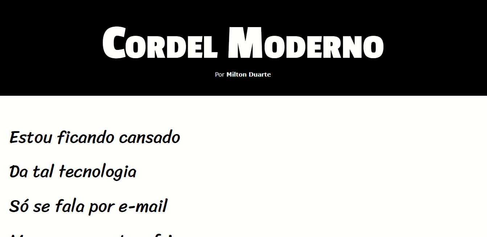

# Cordel Moderno

Cordel promovido por Curso Em Vídeo para ensino de tecnologias WEB.

## 🛠 Tecnologias

- HTML
- CSS
- Git e Github

## 💻 Projeto

Esse cordel foi feito como desafio para ensino de Tecnologias Web por Curso Em Vídeo.

## :memo: Licença

Esse projeto está sob a licença MIT.

## ❤️ Contato

@arielrodrigues460